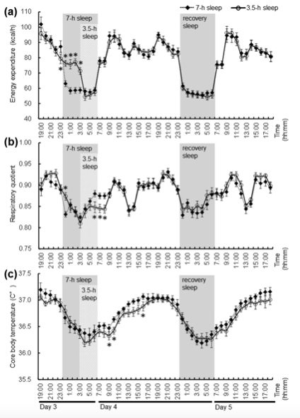

```{r setup, include=FALSE}
knitr::opts_chunk$set(echo = TRUE)
```

## Introduction
The ability to maintain constant internal temperature is a crucial skill for birds and mammals. Our brain and neural network only function at the ideal temperature range. (@morrison2019central) However, all mammals engage in some types of heterothermy, either regional or temporal, to modulate the metabolic demand or better survive in certain environments.(@mitchell2002adaptive) In this module, we use a EDT 11 sensor to measure the change of temperature in the human body both during the day, and during the night (on few hours of sleep), to find the relationship between temperature difference and body mass. Also, we use downloaded data to find the relationship between temperature difference and body mass across a range of different mammals. To analyze these relationships, we created linear models (and logarithmic transformations) based on the temperature measurement and body mass by ggplot in R-studio. 

## Methods
To collect body temperature in the subject of our team, a simple temperature recording data-acquisition system (DAQ) is assembled using an Elegoo Arduino clone and DHT11 sensor; 15 minutes of axial temperature reading was recorded in daytime and early in the morning respectively. 

<center>
  
</center>

To evaluate scaling relationship between mean temperature difference and mass within human subjects, we filtered out outlying data and constructed a linear model using ggplot. To analyze inter-specific relationship, we combined human data with 51 non-human mammals data and applied the same linear model.

## Results
```{r}
library(tidyverse)

f <- list.files("./proj6data",pattern=".csv",full.names=T)

f.l <- list()
for(i in f){
  f.i <- read_csv(i)
  if(ncol(f.i)==1) coln <- 1
  if(ncol(f.i)==2) coln <- 2
  m <- strsplit(i,"_")%>%unlist
  print(m)
  sub <- m[2]%>%tolower()
  time <- m[3]%>%tolower()
  mass <- as.numeric(gsub(".csv","",m[4]))
  f.i <- f.i[,coln]#take only one column
  colnames(f.i) <- "Temp"
  f.l[[i]] <- f.i%>%
    mutate(N=1:n(),Temp=as.numeric(Temp),subject=sub,Time=time,mass=mass)
}

dat <- do.call(rbind,f.l)
```

```{r, fig.cap="Linear Model Depicting Log Tranformed Mean Mass (x-axis) vs Log Transformed Mean Temperature Change (y-axis) From Our Human Data Set"}

dat2 <- dat%>%
  group_by(subject,Time,mass)%>%
  na.omit()%>%
  filter(N>0.95*max(N))%>%
  summarize(m.temp=mean(Temp), n=n())%>%
  pivot_wider(names_from=Time, values_from = c(m.temp,n))%>%
  mutate(td=abs(m.temp_day-m.temp_night))

dat2%>%
  ggplot(aes(log(mass),log(td)))+geom_point()+geom_smooth(method="lm")
```

Our results show that there is no apparent relationship between body temperature difference and mass within human subjects.  There is a slight downward trend, in the data; meaning as mass increases, the difference in mean temperatures slightly decreases. The slope of the graph just slightly negative initially, and close to zero after the log transformation. 

```{r, fig.cap="Linear Model Depicting Mean Mass (x-axis) vs Mean Temperature Change (y-axis) of Each Species From Data Set (mammals)"}
#Inter-specific Scaling
mean.mass = colMeans(dat2[2], na.rm=TRUE)
mean.h.temp= colMeans(dat2[3], na.rm=TRUE)
mean.l.temp = colMeans(dat2[4], na.rm=TRUE)

Human.Data <- data.frame("Primata","Homo sapiens", mean.mass, mean.h.temp, mean.l.temp)
names(Human.Data) <- c("Order", "species","mass.g", "T.high", "T.low")

mammals <- read.csv("mammal.temp.csv")
mammals.df <- rbind(mammals, Human.Data)

temp.change <- mammals.df%>%
  mutate(td=abs(T.high-T.low))

mammals.dat <- temp.change

mammals.dat %>%
  ggplot(aes(mass.g,td))+geom_point()+geom_smooth(method="lm")
```

Following the intra-specific scaling data analysis, mean mass and temperature change were calculated and then added to our inter-specific data set. At first, a linear model representing mean mass values against mean temperature change values was conducted. This representation doesn't allow for accurate understandings so the data was then log transformed.

```{r, fig.cap="Linear Model Depicting Log Tranformed Mean Mass (x-axis) vs Log Transformed Mean Temperature Change (y-axis) of Each Species From Data Set (mammals)"}

mammals.dat %>%
  ggplot(aes(log(mass.g),log(td)))+geom_point()+geom_smooth(method="lm")

```

When the human data is combined with other mammalian data, a negative scaling between mean body temperature difference and mass was found. As the mass of the mammal increases, the difference between the mean temperatures decreases as well. Both of these graphs create line of best fits with negative slopes. 


## Discussions

In humans specifically, the data provided no clear relationship between mass and mean body temperature difference. This would be an allometric growth relationship as the change in mass does not equal the change in the difference in mean temperatures. The data helps to demonstrate that there are stable mechanisms controlling heat loss in humans and these appear to be for the most part consistent across individual human subjects as mass does not greatly differ. Within a small range of masses, we have similar metabolic rates further demonstrating the stability of human body temperature.


When the human data is combined with other mammalian species, a negative relationship is seen. While not a perfectly isometric relationship since the changes in the magnitude of mass and temperature are not directly equal, it is far closer than that of the data consisting of only humans.This demonstrates that the control of temperature oscillations does in fact vary across different mammalian species. Similar studies have been carried out in all different types of mammals and have shown that there is a complex relationship between metabolic rate, body mass, and body temperature. This aligns with our data as we do not see a strong relationship when specifically looking at the human species, but we see a more prominent relationship when data from many mammalian species are combined. 


## Contributions

## References
