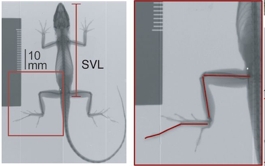

1. Visualize how hind limb length varies with size (i.e., allometry!)
2. Visualize and assess how hind limb length vs. size relationship covary with ecological niche
3. Learn more complex operations in `ggplot` than we've undertaken so far.
4. Evaluate this hindlimb-size relationship using standard frequentist models within and without a phylogenetic context
5. Using an information theory approach, assess the fit of phylogenetically corrected models of hind-limb variation under different modes of character evolution

## Introduction

Ecomorphology is the study that allows people to understand the relationship between the morphology of the organism and its environment. In the Module3 project, we focused on the ecomorphology of anoles, a genus of iguanian reptiles with exceptional diversity[@hagey2017there]. The main purpose of the project is to visualize the difference of allometric relationship between hind limb length and size of Anolis lizard and how hind limb length vs. size relationship covaries with the ecological niche. To analyze our data, we computed standard error and created models based on the measurement of total hind-limb length, perch height, and perch diameter of various ecomorphs.
<center>
[](https://upload.wikimedia.org/wikipedia/common/thumb/4/4b/Green_anole.jpg/320px-Green_anole.jpg)
</center>

<center>

</center>

## Methods

A total of three data sets were used in this project: a phylogenetic relationships tree data of anoles @poe2017phylogenetic, a morphological data and a ecomorphological data of these anoles @hagey2017there. Unique data and that of missing values were filtered prior to analysis, the remaining values were then combined and log transformed in order to create a linear model and a non-linear allometric model of hindlimb vs. SVL that are subsequently compared using AIC. PGLS models were created with or without ecomorph as the covariant and under Brownian motion (BM) and Ornstein-Uhlenbeck (OU) models, respectively. Analysis of perch diameter vs. perch height were performed with the same methods as explained above.

## Results

The initial comparison between the linear and allometric model of Htotal vs. SVL showed the allometric model had a better fit with a lower AIC value. Next, we visualized the hindlimb-SVL relationship with ecomorph as a covariant. The null hypothesis that ecomorphs did not have separate hind-limb to size relationships was rejected due to p=3.761e-09 from ANOVA test, which demonstrated that the ecomorph played an important role to influence the hindlimb-SVL relationship. This model also has a better fit according to our AIC and AICw value. The hindlimb-SVL relationship was then plotted by considering the potential influence of phylogeny; The phylogenetic generalized least squares analysis under BM with ecomorph had the best fit based on AIC operation. At our last step, the PGLS model with the hindlimb-SVL relationship accounting for perch height, perch diameter, and perch height + perch diameter was created under the BM model; both covarients, perch diameter + perch height, together were discovered to be significant predictors of relationship in a phylogentic context based on AICc and AICw.

## Discussion

Results from ANOVA test confirmed ecomorph having significant effect on hindlimb-SVL relationship in anoles. According to the PGLS model that included ecomorph and were placed under BM, specific hindlimb-SVL traits were evolved randomly within each lineage to best fit in specific ecological niches. The condensed magnitude of residuals in the model suggested strong phylogenetic influence on hindlimb-SVL relationship, as did perch diameter and perch height as they were found to be significant predictors. 

## Contributions

Amanda Napoli:reviews, edits, and data 
Haoran Zeng:introduction and result
Nick Graziano: reviews, edits, and data 
Zhiyuan Wang:method and discussion

## Reference

@hagey2017there studied the hind-limb-ecomorph relationship in anoles.

A recent study considered the hindlimb-ecomorph relationship in anoles [@hagey2017there].

```{r, include=FALSE}
library(tidyverse) #always
library(ape) # for evo analysis
library(nlme) #ditto
library(MuMIn) #for AIC
library(geiger) #for eco analysis
library(knitr)
library(rmarkdown)
```

```{r, "load the data"}
anole <- read_csv("anole.dat.csv")
anole.eco <- read_csv("anole.eco.csv")
anole.tree <- read.tree("anole.tre")
```

```{r, "join, filter, mutate to log"}
anole2 <- anole %>%
  left_join(anole.eco) %>%
  filter(!Ecomorph%in%c("U","CH"))%>%
  na.omit()

anole.log <- anole2%>%
  mutate_at(c("SVL","HTotal","PH","ArbPD"), log)
```

```{r,"PGLS models"}
### phylogenetic GLS models

#PGLS under BM, no ecomorph
pgls.BM1 <- gls(HTotal~SVL, correlation=corBrownian(1, phy=anole.tree, form=~Species), data=anole.log, method="ML")

#PGLS under BM, w ecomorph
pgls.BM2 <- gls(HTotal~SVL * Ecomorph2, correlation=corBrownian(1, phy=anole.tree, form=~Species), data=anole.log, method="ML")

#PGLS under OU, no ecomorph
pgls.OU1 <- gls(HTotal~SVL, correlation=corMartins(0, phy=anole.tree, form=~Species), data=anole.log, method="ML")

#PGLS under OU, w eco morph
pgls.OU2 <- gls(HTotal~SVL * Ecomorph2, correlation=corMartins(0, phy=anole.tree, form=~Species), data=anole.log, method="ML")
```

```{r, "AIC}
#AIC operations
anole.phylo.aic <- AICc(pgls.BM1, pgls.BM2, pgls.OU1, pgls.OU2)
anole.phylo.aicw <- aicw(anole.phylo.aic$AICc)
```

```{r, "add residuals"}
#add phylo-corrected residuals
anole.log <- anole.log %>%
  mutate(phylo.res=residuals(pgls.BM2))
```

```{r, "plot residuals", fig.cap="Boxplot of phylogenetically corrected hindlimb residuals versus anole ecomorph"}
#plot residuals
p.eco.phylo <- anole.log %>%
  ggplot(aes(x=Ecomorph2, y=phylo.res)) + geom_boxplot() + stat_summary(fun=mean, geom="point", size=3)

print(p.eco.phylo)
```

```{r}
n.spec <- anole.log%>%
  group_by(Ecomorph2)%>%
  summarise(n.species=n())

n.spec%>%
  kable()

n.spec %>%
  kable(caption = "Number of species within each anole ecomorph included in this study")

paged_table(anole.log, options = list(rows.print = 15))
```

```{r}

```


